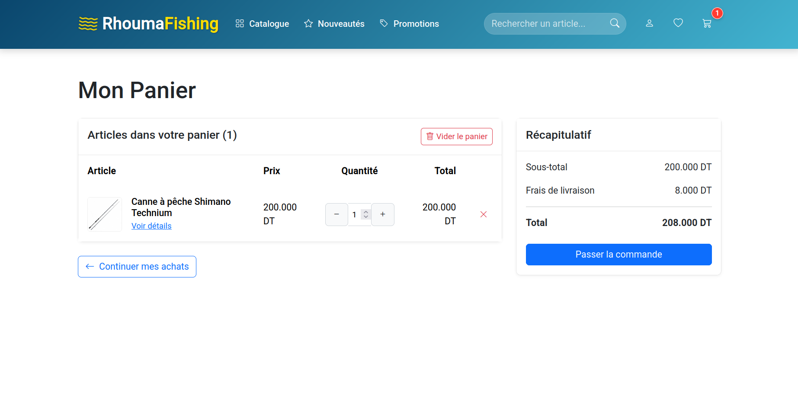
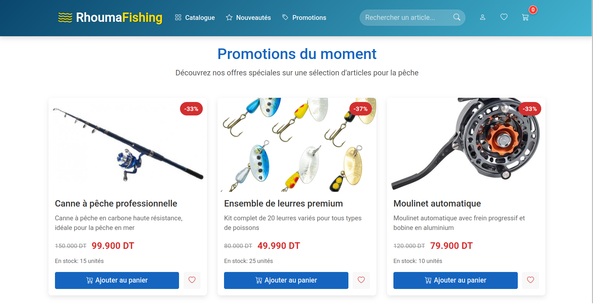

# E-commerce Fishing Articles Application

A complete MEAN stack application for an e-commerce platform specializing in fishing equipment and accessories.

## Table of Contents
- [Overview](#overview)
- [Backend Functionalities](#backend-functionalities)
- [Frontend Features](#frontend-features)
- [User Journey](#user-journey)
- [Admin Features](#admin-features)
- [Technology Stack](#technology-stack)
- [Setup and Installation](#setup-and-installation)

## Overview

This e-commerce platform is built using the MEAN stack (MongoDB, Express, Angular, Node.js) and offers a complete shopping experience for fishing enthusiasts. The application includes features such as product browsing, searching, filtering, cart management, wishlist (favorites), user authentication, and admin controls for product management.

## Backend Functionalities

The backend API is built with Node.js and Express, providing the following endpoints:

### Articles API

- **GET /api/articles** - Retrieve all fishing articles
- **GET /api/articles/:id** - Retrieve a specific article by ID
- **POST /api/articles** - Create a new article (admin only)
- **PUT /api/articles/:id** - Update an existing article (admin only)
- **DELETE /api/articles/:id** - Delete an article (admin only)

The article model includes the following properties:
- Unique ID
- Name
- Description
- Price
- Stock quantity
- Category
- Images
- Date added

The backend is structured with:
- Controllers for handling business logic
- Models for data structure
- Routes for API endpoint definitions
- Configuration for environment variables
- Database connection setup

## Frontend Features

The Angular frontend offers a responsive and intuitive interface with the following main components:

### Customer Features

- **Home Page** - Showcase featured products and promotions
- **Product Catalog** - Browse all fishing products with filtering and pagination
- **Product Details** - View detailed information about products with similar product suggestions
- **Shopping Cart** - Add, remove, and update quantities of items
- **Favorites/Wishlist** - Save products for later
- **Search** - Find products by keywords
- **Filtering** - Filter products by category, price, etc.
- **Ordering** - Sort products by different criteria
- **New Arrivals** - See the latest additions to the catalog
- **Promotions** - View discounted items

### Admin Features

- **Admin Dashboard** - Overview of products and management options
- **Product Management** - Add, edit, and delete products
- **Authentication** - Secure login for administrators

## User Journey

### Home Page
The landing page welcomes customers with featured products and navigation options.

### Browsing Products
Users can browse all products with filtering and pagination.

#### Search Functionality
Find specific products quickly using the search feature.

#### Filtering Products
Filter products based on various criteria.

#### Sorting Products
Sort products by price, name, or other attributes.

#### Pagination
Navigate through multiple pages of products.

### Product Details
View detailed information about a product.

#### Similar Products
See related products that might interest you.

### Shopping Cart
Manage items in your cart before checkout.

### Order Management
Track and manage your orders.

### Favorites
Save products to your wishlist for later consideration.

### New Arrivals
Discover the newest products in the catalog.

### Promotions
Find special deals and discounted items.

## Admin Features

### Admin Login
Secure access for administrators.

### Admin Dashboard
Overview of products and management options.

### Adding New Products
Interface for adding new products to the catalog.

### Updating Products
Edit existing product information.

## Technology Stack

### Backend
- **Node.js** - JavaScript runtime
- **Express** - Web framework
- **MongoDB** - NoSQL database
- **Mongoose** - MongoDB object modeling

### Frontend
- **Angular** - Frontend framework
- **TypeScript** - Programming language
- **HTML/CSS** - Markup and styling
- **Bootstrap** - Responsive UI framework
- **Material Design** - UI components
- **SweetAlert2** - Beautiful, responsive, customizable popup boxes
- **ngx-toastr** - Toast notifications for Angular
- **Font Awesome** - Icon toolkit

## Setup and Installation

### Prerequisites
- Node.js and npm
- MongoDB
- Angular CLI

### Backend Setup
1. Navigate to the backend directory: `cd backend`
2. Install dependencies: `npm install`
3. Configure the database connection in `src/config/config.js`
4. Start the server: `npm start`

### Frontend Setup
1. Navigate to the frontend directory: `cd frontend`
2. Install dependencies: `npm install`
3. Configure the API URL in the environment files
4. Start the Angular development server: `ng serve`
5. Access the application at `http://localhost:4200`